# 🚀 TechZone API | E-Commerce Project

## 🛒 What is TechZone?

**TechZone** is an online electronics shopping platform providing a complete backend solution for managing accounts, products, orders, payments, and more.

---

## 🔐 1. Account & Authentication

- JWT Authentication with ASP.NET Core Identity  
- User Registration & Login  
- Role-Based Access Control: `Admin`, `Customer`  

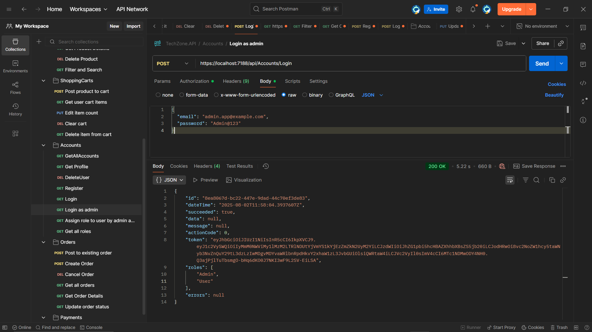  
  

---

## 🧱 2. Clean Architecture & Design Patterns

- N-Tier Structure with clear separation of concerns  
- Generic Repository Pattern  
- AutoMapper for DTO ↔ Entity mapping  
- Result Wrapper Pattern for unified API responses  
- Global Exception Handling Middleware  
- Server-side & Database-level Validation  
- Asynchronous Programming  
- Serilog for structured logging (errors stored in DB)  
- IMemoryCache for category caching  

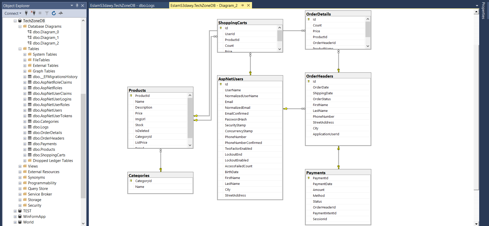  

---

## 🛍️ 3. Product Management

- Full CRUD Operations  
- Pagination for performance  
- Soft Delete (Global Query Filter)  
- Partial Update with PATCH  
- Filtering by Brand & Searching by Product Name  

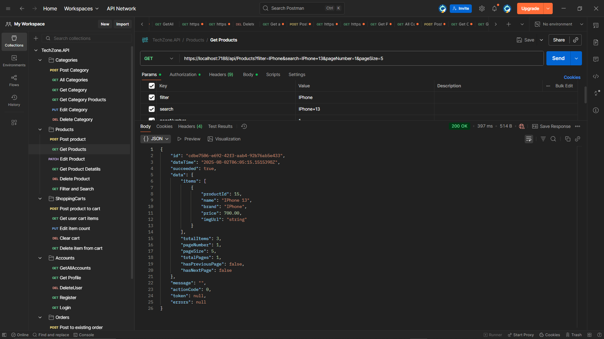  

---

## 📦 4. Shopping Cart

- Add, Remove, Update Items  
- Clear Entire Cart  

  

---

## 📑 5. Order Management

- Create, Read, Delete Orders  
- Update Status & Shipping Date  
- Track Order Status  

  

---

## 💸 6. Payments (Stripe Integration)

- Secure checkout via Stripe  
- Auto-redirect to payment session  

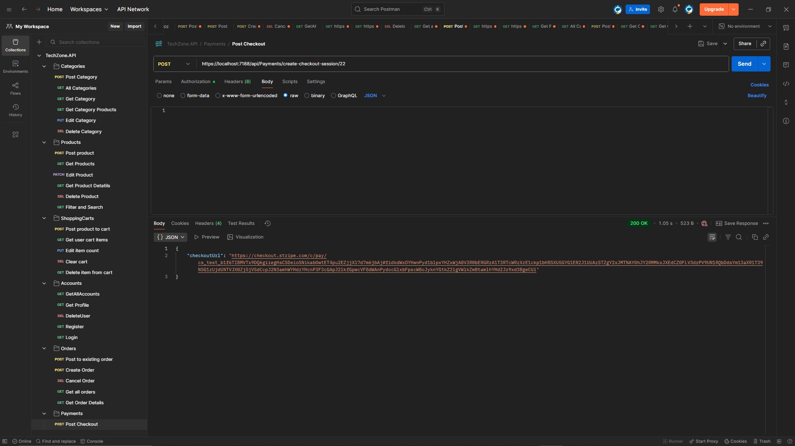  
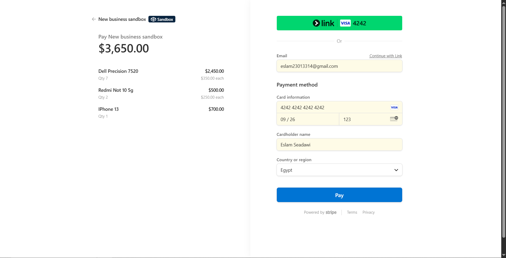  

---

## ✉️ 7. Email Notifications (SMTP)

- Order Confirmation Emails  
- Status Update Notifications  

  
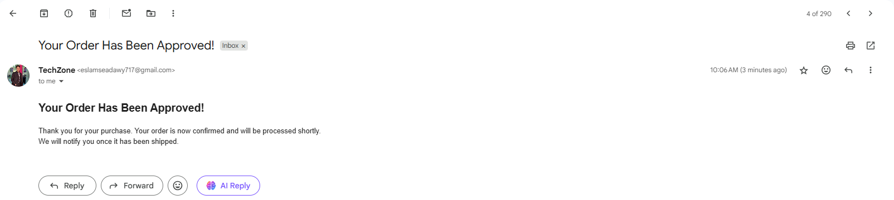  
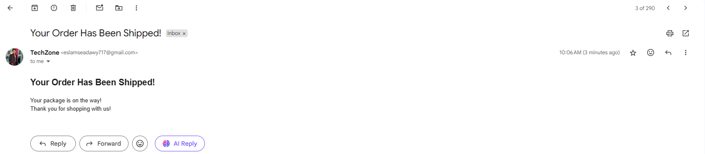  
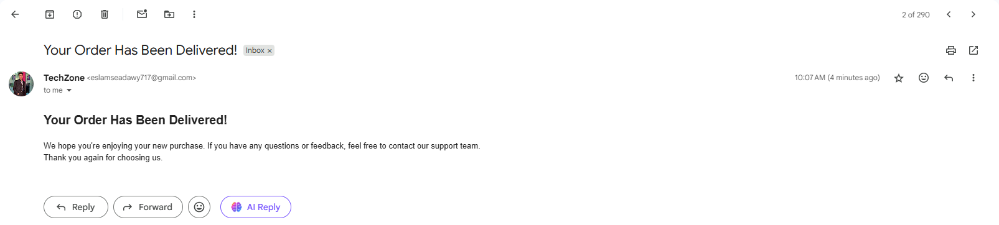  
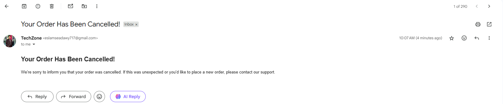  

---

## 🧪 8. Testing

- Full Postman Collection covering all endpoints  

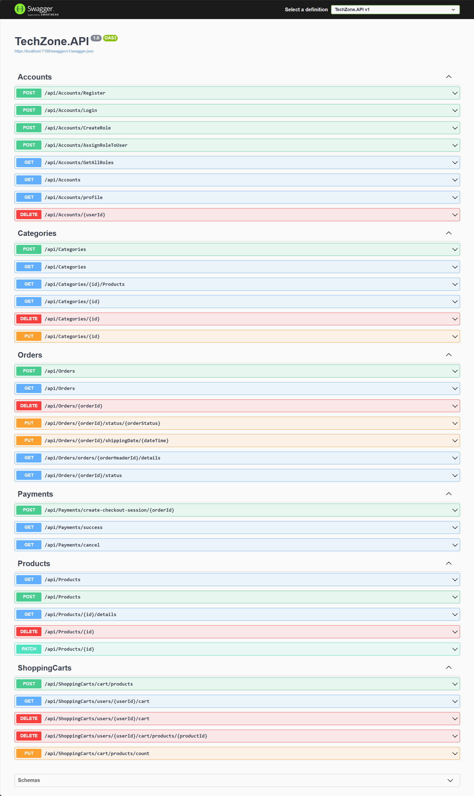  

---

## 🗂️ 9. Roles & Permissions

### 👤 Admin:
- Manage users & roles  
- Manage products, orders, categories  
- Full access to admin endpoints  

### 🛍️ Customer:
- Browse & search products  
- Add to cart, place orders  
- Make payments & track order status  

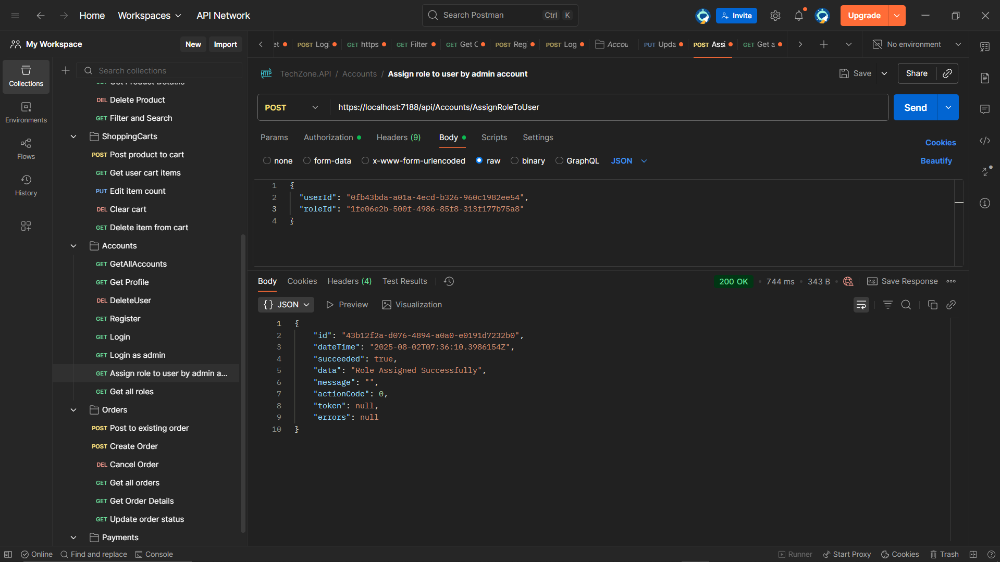  
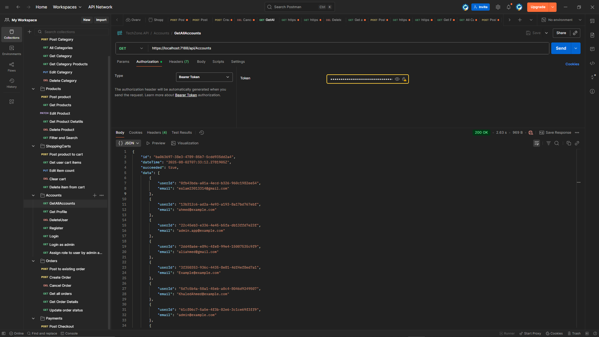  
